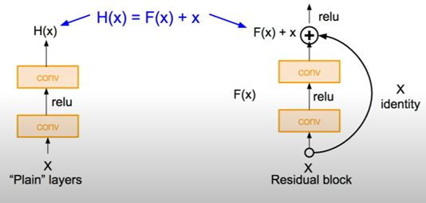

# GenderDefine
This project focus one detects gender via photos

# Goole Colab
https://colab.research.google.com/drive/17vLP-yIzcBVtneWEpyjDBb8wzL9-bTNs?usp=sharing

Before running, please check that runtime set up with GPU

# Introduction
Gender analysis using AI technology is always a problem that attracts a lot of attention and brings many benefits to large companies. For example, determining the gender of cosmetic users will help make reasonable recommendations from there to increase revenue. However, to accurately assess the user's gender, it is quite complicated because the existing dataset has many problems, such as blurred or squished images, faces hidden by objects, or simply little data. Therefore, it is a challenge to have a model that can accurately analyze the real-world data set.

# Problem Analysis
The problem input is a dataset with multiple faces, including both males and females, and the desired output is for the computer to be able to distinguish between images of males and females. Therefore, the problem belongs to the classification category. With only two classes, we do not need a large model for analysis, so we can choose a small CNN model such as ResNet-18. ResNet is a type of CNN model developed in 2015. The special feature of this model is that there is a residual block between the convolution layers so that the data can skip some layers. In fact, skipping some layers not only speeds up the process but also provides high efficiency in the training process.

ResNet-18 is a ResNet model with 18 layers. The advantage of this model is that it uses fewer resources but can still achieve high efficiency in problems with few classes.

In this problem, the chosen dataset is from the Kaggle website.
https://www.kaggle.com/datasets/rashikrahmanpritom/gender-recognition-dataset?resource=download

The dataset consists of 10,000 training images, 2,000 validation images, and 1,000 test images. Most of the images are faces of famous Hollywood actors, with a size of 100x100x3. The problems with this dataset include: many images are blurry and unclear; some images are too bright or too dark; some images are not human faces; some images have more than one face; and some images are mislabeled. These errors can cause significant obstacles in the training process and reduce the effectiveness of inference. Therefore, we need a data validation step to eliminate invalid images. Data validation is a method of using one or more algorithms to identify invalid images to produce a suitable dataset for the training process. Moreover, data validation can also filter out unsuitable images when used in inference.

# Built model
This project using Resnet 18 (another option is available to test) is run with the AdamW optimizer.
Combine them with data argumentation (resize, randomize, and randomize horizontally) and data valuation (blur detection).
 
For further analistic please read the built model file

# Ongoing Issues
Some images contain more than one face, leading to incorrect evaluations during training. The dataset also contains some irrelevant and non-human facial images. Therefore, the temporary solution for this issue is to filter them manually. Lastly, this dataset mainly includes faces of people from Europe and America, so the accuracy of face recognition for Asian faces is not high. When tested with Asian faces, the accuracy only reaches 80%.

# Overall
It is not a new task to perform gender classification, however, accurately determining gender with a dataset containing many invalid images is still a challenging problem. Through experimentation and research with limited resources, a suitable solution has been proposed. The selected model is resnet-18, along with data augmentation and especially data validation, which helps to eliminate most of the flawed images. The final result achieved for this task is 93.7%, a good result for a dataset with many shortcomings.